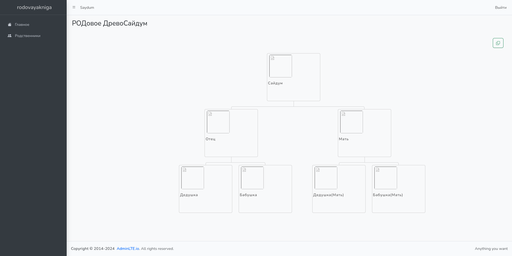
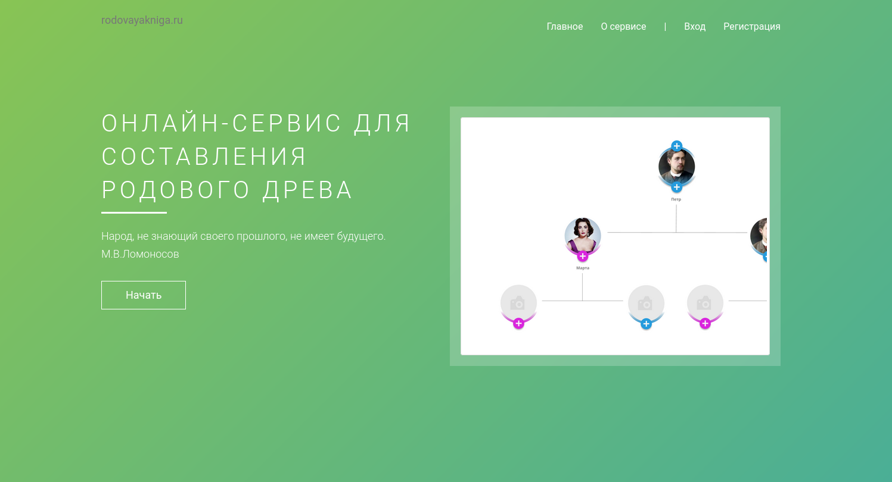

# 1. Что это?
[rodovayakniga.ru](https://rodovayakniga.ru/) - Это онлайн-сервис для составления РОДового Древа совместно с РОДственгниками.
На данный момент реализовн
- Составление РОДого Дрвеа до 3‑го колена.
- Есть возможность поделиться по ссылке

Функционал который мы скоро добавим :)
- Поиск человека по И.Ф.О (Если пользователь разрешил) поможет найти дальних РОДственников
- Составлене РОДового древа до 16го колена
- Приглашать РОДственников
- Составление РОДовой книги совместно с РОДственниками
- Отображение вклада в составления РОДовое Древо, книгу.
- Возможность скачать книгу
- Возможность получить фото РОДового Древа
- Помощь в составлении РОДовых книг

## 1.2 В нашем проекте мы используем
- Идея из книг Звенящие кедры России автор Владимира Мегре [megre.ru](https://megre.ru/catalog/knigi/)
- Основная структура составления РОДого Древа [rodipriroda.com/posts/Rodoslovnaja](https://rodipriroda.com/posts/Rodoslovnaja)


# 2. Для установки локально

# 2.1 Необходимо установить
- PHP8.3
- npm10.8
- composer2.7.7

# 2.2 Установка и запуск
```bash
# Клонируем проект
git clone https://github.com/saydum/rodovayakniga.ru.git
cd rodovayakniga.ru

# Запускаем установку зависимостей
composer install
npm i

# запускаем приложение
php artisan serve
```

# 3. Примеры

| App                   | Index                 |
|-----------------------|-----------------------|
|  |  | 
|                       |                       |


